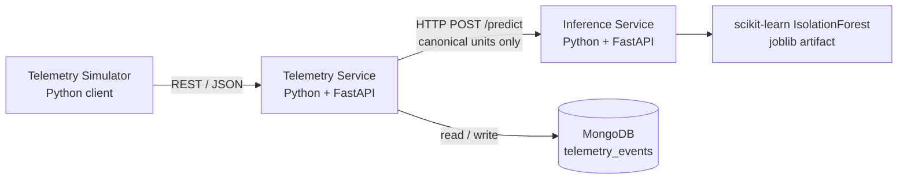
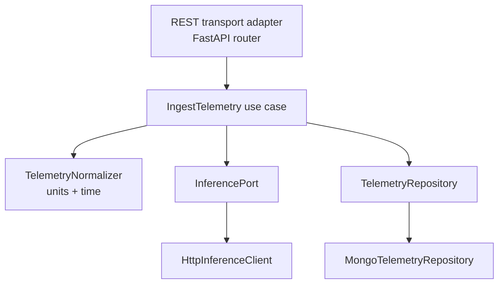

# fleet-ai-anomaly-detection-system

A Python backend system for **multinational EV fleet telemetry ingestion** and **ML-based anomaly
detection**.

Vehicles across sites in different countries emit telemetry in their local units and local time.
The system normalizes that telemetry into a single canonical representation, scores it with a
scikit-learn model, and stores it as an append-only event history that can be queried per vehicle
by time range.

> **Status:** the MVP write path is complete. Telemetry is validated, normalized to canonical
> units and UTC, scored synchronously by the Inference Service over HTTP, and stored in MongoDB
> with idempotent, first-write-wins semantics on `event_id`. The anomalies endpoint returns real
> model verdicts.
>
> The two failure policies are opposite by design: an inference outage still stores the telemetry
> with `inference.status: "FAILED"` and no invented verdict (**fail-open**), while a persistence
> outage returns `503` and acknowledges nothing (**fail-closed**). The simulator is not
> implemented. Everything else below is either *specified for the MVP implementation* or marked as
> a *future* concern.

---

## 1. Design goal

Keep the MVP small enough to implement and explain clearly, while preserving clean extension
points for future capabilities (MQTT ingestion, realtime delivery, alerting, async processing,
multiple models, alternate storage, charging/OCPP).

Two rules follow from that goal and are applied throughout the design:

1. **Business logic lives in one place.** Telemetry ingestion is an application *use case*
   (`IngestTelemetry`). REST is only a transport adapter in front of it. A future MQTT adapter
   calls the same use case rather than re-implementing normalization, validation, inference and
   persistence.
2. **Abstractions must be earned.** Explicit ports exist only where there is a real external
   system or a genuinely likely alternate implementation. There is no hexagonal-architecture
   framework, no generic repository layer, and no plugin registry. See
   [`docs/ARCHITECTURE.md`](docs/ARCHITECTURE.md#4-ports-and-adapters) for what is deliberately
   *not* abstracted.

---

## 2. MVP architecture at a glance



Inside the Telemetry Service:



---

## 3. Running it locally

Everything — both services and MongoDB — comes up with one command. The only
prerequisite is Docker with Compose v2 (`docker compose version`).

```bash
docker compose up --build
```

That builds both images, **trains the anomaly model as part of the inference
image build**, starts MongoDB, and wires the three together. No manual step, no
model file to create first, nothing to install locally.

| | URL |
| --- | --- |
| Telemetry Service | <http://localhost:8000> — [Swagger](http://localhost:8000/docs) · [OpenAPI](http://localhost:8000/openapi.json) |
| Inference Service | <http://localhost:8001> — [Swagger](http://localhost:8001/docs) · [OpenAPI](http://localhost:8001/openapi.json) |
| MongoDB | `mongodb://localhost:27017` — exposed for inspection |

Health endpoints:

```bash
curl localhost:8000/health          # liveness: is the process up
curl localhost:8000/health/ready    # readiness: can it reach the telemetry store
curl localhost:8001/health          # liveness + whether a model is loaded
curl localhost:8001/model/info      # the loaded artifact's identity and feature order
```

Send one event — in **source units**, to watch normalization happen:

```bash
curl -X POST localhost:8000/api/v1/telemetry -H 'Content-Type: application/json' -d '{
  "schema_version": "1.0",
  "event_id": "demo-0001",
  "vehicle_id": "veh-tw-0142",
  "site_id": "site-taipei-01",
  "event_time": "2026-09-01T22:00:00+08:00",
  "metrics": {
    "soc":                 {"value": 62.0,   "unit": "percent"},
    "battery_voltage":     {"value": 378.0,  "unit": "V"},
    "battery_current":     {"value": -190.0, "unit": "A"},
    "battery_temperature": {"value": 84.2,   "unit": "degF"},
    "speed":               {"value": 39.15,  "unit": "mph"},
    "motor_rpm":           {"value": 5170.0, "unit": "rpm"}
  }
}'
```

It comes back `201` with `speed` in km/h, `battery_temperature` in degC, and the
model's verdict. Then read it back:

```bash
curl "localhost:8000/api/v1/vehicles/veh-tw-0142/telemetry?start=2026-08-01T00:00:00Z&end=2026-12-01T00:00:00Z"
curl "localhost:8000/api/v1/vehicles/veh-tw-0142/anomalies?start=2026-08-01T00:00:00Z&end=2026-12-01T00:00:00Z"
```

### Inspecting and stopping

```bash
docker compose ps                          # container state and health
docker compose logs -f                     # follow everything
docker compose logs -f telemetry-service   # one service
docker compose logs -f inference-service

docker compose down       # stop and remove containers + network — MongoDB data KEPT
docker compose down -v    # the same, and DELETE the MongoDB volume
```

The distinction matters: telemetry lives in the named volume `mongodb-data`, so
it survives `docker compose down`, `docker compose restart`, and container
crashes. Only `down -v` throws it away — which is the deliberate way to start
from an empty database.

### The model artifact

```text
source code → docker build → ml/train.py → model.joblib inside the image
            → container start → artifact loaded once → predictions served
```

Training happens **once, during the image build**. The service never trains at
startup and never in a request handler, so training and serving stay separate.
Training is deterministic — fixed seeds and explicit hyperparameters — so the
same source always produces the same model. That is why the ~20 MB artifact is
not in Git: it is reproducible from the source that is.

Rebuilding from scratch, including retraining:

```bash
docker compose build --no-cache
```

### If port 8000, 8001 or 27017 is already taken

The host ports default to those values and can be overridden:

```bash
TELEMETRY_HOST_PORT=18000 INFERENCE_HOST_PORT=18001 MONGODB_HOST_PORT=37017 docker compose up -d
```

Only the host side moves; inside the network the services always reach each
other at `mongodb:27017` and `inference-service:8001`.

### Running without Docker

Each service also runs directly, which is how the test suites run. See
[§10](#10-the-anomaly-model) for training and serving the model by hand.

---

## 4. MVP scope

### Telemetry Service

| Method | Path | Purpose |
| --- | --- | --- |
| `GET` | `/health` | Liveness of the service process |
| `POST` | `/api/v1/telemetry` | Ingest one telemetry event |
| `GET` | `/api/v1/vehicles/{vehicle_id}/telemetry` | Telemetry history for a vehicle, by time range |
| `GET` | `/api/v1/vehicles/{vehicle_id}/anomalies` | Anomalous events for a vehicle, by time range |

### Inference Service

| Method | Path | Purpose |
| --- | --- | --- |
| `GET` | `/health` | Liveness + whether the model artifact is loaded |
| `GET` | `/model/info` | Model name, version, algorithm, feature order, canonical units |
| `POST` | `/predict` | Score one canonical feature vector |

Full request/response contracts: [`docs/ARCHITECTURE.md`](docs/ARCHITECTURE.md#6-api-contracts).

---

## 5. Telemetry input contract

Every event carries an identity, a source, a timezone-aware timestamp, and metrics with
**per-metric explicit units**. Units are *not* a request-level `"metric"` / `"imperial"` flag — a
single device may legitimately report speed in mph and temperature in degC.

```json
{
  "schema_version": "1.0",
  "event_id": "3f0a9c2e-6f4b-4a6f-9d6e-2b1c8f4a77e1",
  "vehicle_id": "veh-tw-0142",
  "site_id": "site-taipei-01",
  "event_time": "2026-08-31T09:14:22.481+08:00",
  "metrics": {
    "soc":                 { "value": 78.5,  "unit": "percent" },
    "battery_voltage":     { "value": 396.2, "unit": "V" },
    "battery_current":     { "value": -14.7, "unit": "A" },
    "battery_temperature": { "value": 96.4,  "unit": "degF" },
    "speed":               { "value": 32.3,  "unit": "mph" },
    "motor_rpm":           { "value": 4120,  "unit": "rpm" }
  }
}
```

### Canonical internal units

All telemetry is normalized **before** persistence and **before** inference.

| Metric | Canonical unit | Accepted source units |
| --- | --- | --- |
| `soc` | `percent` | `percent`, `fraction` |
| `battery_voltage` | `V` | `V`, `mV` |
| `battery_current` | `A` | `A`, `mA` |
| `battery_temperature` | `degC` | `degC`, `degF`, `K` |
| `speed` | `km/h` | `km/h`, `mph`, `m/s` |
| `motor_rpm` | `rpm` | `rpm` |

The inference service only ever receives canonical values. The model must never depend on client
display preferences or on source measurement units.

### Time

* `event_time` must be **timezone-aware ISO-8601**; naive timestamps are rejected.
* `event_time` is normalized to **UTC** for storage and querying.
* `received_at` is stamped by the Telemetry Service on arrival.
* Queries are ordered primarily by `event_time`, not by insertion order.

Why both timestamps exist, how clock skew is validated, and how out-of-order events behave:
[`docs/ARCHITECTURE.md`](docs/ARCHITECTURE.md#8-time-handling).

---

## 6. Key decisions

Recorded as concise ADRs in [`docs/DECISIONS.md`](docs/DECISIONS.md):

| ADR | Decision |
| --- | --- |
| 0001 | MongoDB as the MVP telemetry event store; PostgreSQL + JSONB documented as a viable alternative |
| 0002 | Synchronous HTTP inference for the MVP |
| 0003 | Canonical internal units, normalized at the ingestion boundary |
| 0004 | Timezone-aware input, UTC persistence, IANA names for any stored site timezone |
| 0005 | `event_id` as the idempotency key, enforced by a unique index and independent of storage identity |
| 0006 | Fail-open persistence when inference fails; fail-closed ingestion when persistence fails |
| 0007 | Transport-independent ingestion use case |
| 0008 | Deliberately limited ports: only `InferencePort` and `TelemetryRepository` |
| 0009 | `PENDING` as the unscored inference state |

The two that most shape day-to-day behavior:

* **Failure policy — two dependencies, opposite policies.**
  * *Inference failure → **fail-open for telemetry persistence**.* If inference times out or is
    unavailable, the telemetry is still stored, `inference.status` is recorded as `FAILED`, and
    **no anomaly result is invented**. A failed inference never appears in the anomalies endpoint.
  * *Persistence failure → **fail-closed for ingestion**.* If the event cannot be stored, ingestion
    returns `503` rather than acknowledging it, so the client's idempotent retry is the recovery
    mechanism. Fail-open applies to the derived score, never to the measurement.
* **Idempotent ingestion, on domain identity.** `event_id` is the globally unique **domain**
  identifier of an emitted event and the idempotency key in the API contract. A client retry must
  not create a second record, and a conflicting payload reusing an existing `event_id` must never
  overwrite the original. Duplicate detection relies on a **unique index on `event_id`** — not on
  the storage engine's own key: MongoDB keeps its ordinary internal `_id`, which never leaves the
  persistence layer, so a future PostgreSQL implementation reproduces the same semantics with
  `UNIQUE (event_id)`. The mechanism is specified here but not yet implemented.

---

## 7. Repository layout

```text
compose.yaml        # the whole stack: mongodb + inference-service + telemetry-service
telemetry-service/
  Dockerfile
  app/
    api/routes/     # FastAPI routers, request/response schemas, error mapping
    application/    # IngestTelemetry use case, TelemetryRepository + InferencePort
    domain/         # source + canonical models, units, conversions, normalizer
    infrastructure/ # MongoDB client, indexes, repository, HTTP inference client
    core/           # settings
  tests/
inference-service/
  Dockerfile        # trains the model during the build
  app/
    api/routes/     # FastAPI routers, canonical feature schemas, error mapping
    application/    # InferenceService
    domain/         # feature vocabulary, prediction and model types
    infrastructure/ # artifact read/write + validation, IsolationForest wrapper
    core/           # settings
  ml/               # synthetic data generator + training script
  tests/
docs/
```

Each service is independently runnable and has its own `requirements.txt`.

Arriving with the phases that need them: `infrastructure/` and `application/ports` in the
Telemetry Service (with the first repository and inference-client implementations), `model/` in
the Inference Service, and top-level `ml/` and `simulator/`. Empty packages are not created ahead
of the code that fills them.

---

## 8. Roadmap

| Phase | Content |
| --- | --- |
| 0 | Requirements and architecture — README, ARCHITECTURE, DECISIONS, config surface |
| 1 | Service foundations and contracts — both FastAPI services, API contracts, schemas, domain model, `IngestTelemetry` boundary, validation, tests |
| 2 | Telemetry normalization — `CanonicalTelemetryEvent`, `TelemetryNormalizer`, unit conversion, UTC + `received_at`, clock-skew bounds |
| 3 | MongoDB persistence and idempotency — `TelemetryRepository`, unique `event_id`, duplicate/conflict handling, indexes, history and anomaly queries |
| 4 | Anomaly model and Inference Service — synthetic training data, IsolationForest training, joblib artifact, load-time validation, real `/predict` and `/model/info` |
| 5 | Telemetry ↔ inference integration — `InferencePort`, HTTP client, synchronous scoring, fail-open inference, `COMPLETED`/`FAILED` persistence |
| 6 | **Containerization (current)** — Dockerfiles, Docker Compose, MongoDB volume, healthchecks, model trained at image build |
| 7+ | Simulator, and the concerns listed as future below |

Sequencing beyond the current phase is decided per phase, not fixed here.

---

## 9. Explicitly out of scope for the MVP

Frontend · authentication/RBAC · MQTT · Redis · Kafka · Celery · Kubernetes · AWS · WebSocket /
Socket.IO · alert engine · OCPP · charging simulator · model registry · multi-region deployment ·
production HA · distributed transactions.

These are *designed for* where it costs nothing (see
[Future extension points](docs/ARCHITECTURE.md#14-future-extension-points)) and *implemented*
nowhere.

---

## 10. The anomaly model

**IsolationForest**, trained offline on synthetic data, served by the Inference Service.

*Why IsolationForest.* Anomaly labels for fleet telemetry are scarce, and this project
demonstrates an end-to-end model deployment lifecycle rather than maximizing predictive accuracy.
IsolationForest needs no labels, trains in under a second here, and has an interpretable decision
boundary.

*What it is trained on.* `inference-service/ml/generate_training_data.py` produces deterministic
synthetic samples of normal operation. Voltage tracks state of charge, motor speed tracks road
speed, and current tracks load, so the model learns a joint structure rather than six independent
ranges — which is what lets it flag `0 km/h at 9000 rpm`, a sample whose values are each
individually ordinary.

> **The synthetic dataset and thresholds are demonstration assumptions and are not validated
> against a specific production EV platform.** IsolationForest also cannot extrapolate beyond its
> training range, so a single wildly out-of-range feature is not guaranteed to be flagged.

*Features*, in the one authoritative order used for training, inference and metadata alike:

```text
soc · battery_voltage · battery_current · battery_temperature · speed · motor_rpm
```

Reordering them is a model version change, not a refactor, and the loader refuses an artifact whose
recorded order differs.

*`anomaly_score`* is **anomaly-oriented: higher means more anomalous.** It is the negated
IsolationForest decision function, `-decision_function(x)`, so the model's own decision boundary
sits at zero — above `0` is an outlier, `0` or below an inlier. `is_anomaly` comes from the model's
own prediction. The score is a **ranking score, not a probability**: it is unbounded and
deliberately not squashed into `[0, 1]`.

*Training and serving are separate.* The service never trains; it loads one artifact at startup and
reuses it for every request. If the artifact is missing, corrupt, or records a different feature
vocabulary, the process still starts, `/health` reports `model_loaded: false`, and `/predict` and
`/model/info` answer `503 MODEL_NOT_LOADED` rather than inventing a verdict.

### How the Telemetry Service uses it

Each ingested event is scored **synchronously** over HTTP — one attempt, a bounded
`INFERENCE_TIMEOUT_SECONDS` (default 2 s), and **no retries**, because the fail-open policy already
protects the measurement and a retry inside the request would only add tail latency.

| Outcome | Stored `inference` | HTTP |
| --- | --- | --- |
| Model answered | `COMPLETED` with `is_anomaly`, `anomaly_score`, `model_name`, `model_version` | `201` |
| Timeout / unreachable / upstream 5xx / unusable response | `FAILED` with `error_code`, every verdict field `null` | `201` — the telemetry is kept |
| Store unavailable | nothing written | `503 PERSISTENCE_UNAVAILABLE` |
| Retry of a stored `event_id` | unchanged; **inference is not called again** | `200`, `duplicate: true` |

Failure codes are `INFERENCE_TIMEOUT`, `INFERENCE_UNAVAILABLE`, `INFERENCE_UNREACHABLE` and
`INFERENCE_INVALID_RESPONSE`. A `200` is not trusted on its own: the response body is validated
before it becomes a verdict, so a malformed one is recorded as `FAILED` rather than stored as
`COMPLETED`.

An inference outage never makes the Telemetry Service unready — `/health/ready` checks only the
telemetry store, because ingestion is fail-closed on persistence and fail-open on inference.

```bash
# both services, pointed at each other
cd inference-service && PYTHONPATH=. uvicorn app.main:app --port 8001
cd telemetry-service && INFERENCE_SERVICE_URL=http://127.0.0.1:8001 \
    PYTHONPATH=. uvicorn app.main:app --port 8000
```

### Retraining locally

```bash
cd inference-service
PYTHONPATH=. python ml/train.py          # writes ml/artifacts/isolation_forest_v0_1_0.joblib
```

The artifact is git-ignored — it is a ~20 MB generated binary — and rebuilt from the script.
`--samples`, `--seed`, `--model-version` and `--output` are available.

### Running the Inference Service

```bash
cd inference-service
PYTHONPATH=. uvicorn app.main:app --port 8001
```

| Endpoint | Behaviour |
| --- | --- |
| `GET /health` | Liveness, plus `model_loaded`. Always `200` while the process is alive |
| `GET /model/info` | Name, version, algorithm, training time, feature order, canonical units, artifact digest and sklearn version — all read from the loaded artifact |
| `POST /predict` | Scores one canonical feature vector; `422` on a contract violation, `503` with no model |

---

## 11. Configuration

`.env.example` documents the full configuration surface of both services. It contains no secrets
and is the only environment file committed to the repository.

## 12. Documentation

* [`docs/ARCHITECTURE.md`](docs/ARCHITECTURE.md) — components, contracts, data model, failure
  policy, multinational concerns, extension points.
* [`docs/DECISIONS.md`](docs/DECISIONS.md) — ADR-style decision records.
