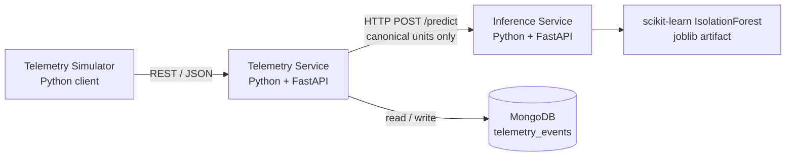
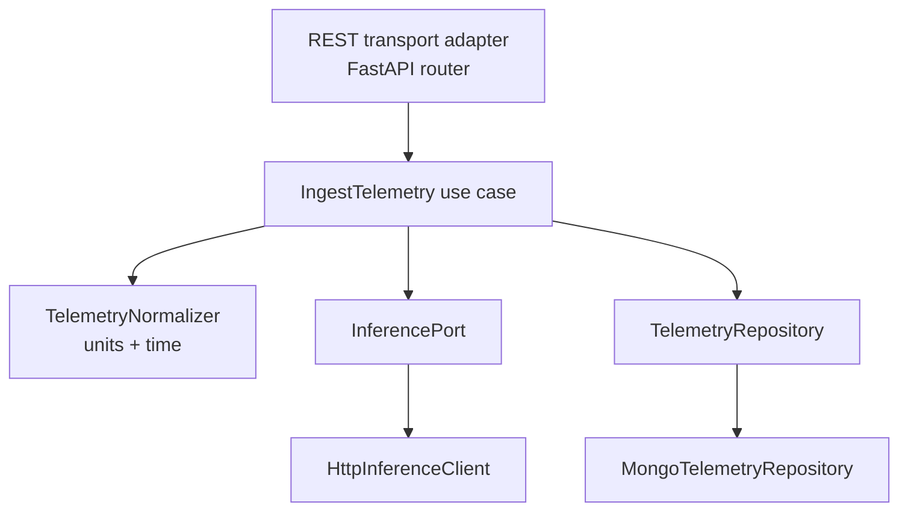

# fleet-ai-anomaly-detection-system

A Python backend system for **multinational EV fleet telemetry ingestion** and **ML-based anomaly
detection**.

Vehicles across sites in different countries emit telemetry in their local units and local time.
The system normalizes that telemetry into a single canonical representation, scores it with a
scikit-learn model, and stores it as an append-only event history that can be queried per vehicle
by time range.

> **Status:** telemetry ingestion works end to end — validated, normalized to canonical units and
> UTC, and stored in MongoDB with idempotent, first-write-wins semantics on `event_id`. Both
> history endpoints read from the store. Inference, the model and the simulator are not implemented
> yet, so a stored event carries `inference.status: "PENDING"` — stored but never scored — and the
> anomalies endpoint correctly returns nothing for it. Everything else described below is either
> *specified for the MVP implementation* or explicitly marked as a *future* concern.

---

## 1. Design goal

Keep the MVP small enough to implement and explain clearly, while preserving clean extension
points for future capabilities (MQTT ingestion, realtime delivery, alerting, async processing,
multiple models, alternate storage, charging/OCPP).

Two rules follow from that goal and are applied throughout the design:

1. **Business logic lives in one place.** Telemetry ingestion is an application *use case*
   (`IngestTelemetry`). REST is only a transport adapter in front of it. A future MQTT adapter
   calls the same use case rather than re-implementing normalization, validation, inference and
   persistence.
2. **Abstractions must be earned.** Explicit ports exist only where there is a real external
   system or a genuinely likely alternate implementation. There is no hexagonal-architecture
   framework, no generic repository layer, and no plugin registry. See
   [`docs/ARCHITECTURE.md`](docs/ARCHITECTURE.md#4-ports-and-adapters) for what is deliberately
   *not* abstracted.

---

## 2. MVP architecture at a glance



Inside the Telemetry Service:



---

## 3. MVP scope

### Telemetry Service

| Method | Path | Purpose |
| --- | --- | --- |
| `GET` | `/health` | Liveness of the service process |
| `POST` | `/api/v1/telemetry` | Ingest one telemetry event |
| `GET` | `/api/v1/vehicles/{vehicle_id}/telemetry` | Telemetry history for a vehicle, by time range |
| `GET` | `/api/v1/vehicles/{vehicle_id}/anomalies` | Anomalous events for a vehicle, by time range |

### Inference Service

| Method | Path | Purpose |
| --- | --- | --- |
| `GET` | `/health` | Liveness + whether the model artifact is loaded |
| `GET` | `/model/info` | Model name, version, algorithm, feature order, canonical units |
| `POST` | `/predict` | Score one canonical feature vector |

Full request/response contracts: [`docs/ARCHITECTURE.md`](docs/ARCHITECTURE.md#6-api-contracts).

---

## 4. Telemetry input contract

Every event carries an identity, a source, a timezone-aware timestamp, and metrics with
**per-metric explicit units**. Units are *not* a request-level `"metric"` / `"imperial"` flag — a
single device may legitimately report speed in mph and temperature in degC.

```json
{
  "schema_version": "1.0",
  "event_id": "3f0a9c2e-6f4b-4a6f-9d6e-2b1c8f4a77e1",
  "vehicle_id": "veh-tw-0142",
  "site_id": "site-taipei-01",
  "event_time": "2026-08-31T09:14:22.481+08:00",
  "metrics": {
    "soc":                 { "value": 78.5,  "unit": "percent" },
    "battery_voltage":     { "value": 396.2, "unit": "V" },
    "battery_current":     { "value": -14.7, "unit": "A" },
    "battery_temperature": { "value": 96.4,  "unit": "degF" },
    "speed":               { "value": 32.3,  "unit": "mph" },
    "motor_rpm":           { "value": 4120,  "unit": "rpm" }
  }
}
```

### Canonical internal units

All telemetry is normalized **before** persistence and **before** inference.

| Metric | Canonical unit | Accepted source units |
| --- | --- | --- |
| `soc` | `percent` | `percent`, `fraction` |
| `battery_voltage` | `V` | `V`, `mV` |
| `battery_current` | `A` | `A`, `mA` |
| `battery_temperature` | `degC` | `degC`, `degF`, `K` |
| `speed` | `km/h` | `km/h`, `mph`, `m/s` |
| `motor_rpm` | `rpm` | `rpm` |

The inference service only ever receives canonical values. The model must never depend on client
display preferences or on source measurement units.

### Time

* `event_time` must be **timezone-aware ISO-8601**; naive timestamps are rejected.
* `event_time` is normalized to **UTC** for storage and querying.
* `received_at` is stamped by the Telemetry Service on arrival.
* Queries are ordered primarily by `event_time`, not by insertion order.

Why both timestamps exist, how clock skew is validated, and how out-of-order events behave:
[`docs/ARCHITECTURE.md`](docs/ARCHITECTURE.md#8-time-handling).

---

## 5. Key decisions

Recorded as concise ADRs in [`docs/DECISIONS.md`](docs/DECISIONS.md):

| ADR | Decision |
| --- | --- |
| 0001 | MongoDB as the MVP telemetry event store; PostgreSQL + JSONB documented as a viable alternative |
| 0002 | Synchronous HTTP inference for the MVP |
| 0003 | Canonical internal units, normalized at the ingestion boundary |
| 0004 | Timezone-aware input, UTC persistence, IANA names for any stored site timezone |
| 0005 | `event_id` as the idempotency key, enforced by a unique index and independent of storage identity |
| 0006 | Fail-open persistence when inference fails; fail-closed ingestion when persistence fails |
| 0007 | Transport-independent ingestion use case |
| 0008 | Deliberately limited ports: only `InferencePort` and `TelemetryRepository` |
| 0009 | `PENDING` as the unscored inference state |

The two that most shape day-to-day behavior:

* **Failure policy — two dependencies, opposite policies.**
  * *Inference failure → **fail-open for telemetry persistence**.* If inference times out or is
    unavailable, the telemetry is still stored, `inference.status` is recorded as `FAILED`, and
    **no anomaly result is invented**. A failed inference never appears in the anomalies endpoint.
  * *Persistence failure → **fail-closed for ingestion**.* If the event cannot be stored, ingestion
    returns `503` rather than acknowledging it, so the client's idempotent retry is the recovery
    mechanism. Fail-open applies to the derived score, never to the measurement.
* **Idempotent ingestion, on domain identity.** `event_id` is the globally unique **domain**
  identifier of an emitted event and the idempotency key in the API contract. A client retry must
  not create a second record, and a conflicting payload reusing an existing `event_id` must never
  overwrite the original. Duplicate detection relies on a **unique index on `event_id`** — not on
  the storage engine's own key: MongoDB keeps its ordinary internal `_id`, which never leaves the
  persistence layer, so a future PostgreSQL implementation reproduces the same semantics with
  `UNIQUE (event_id)`. The mechanism is specified here but not yet implemented.

---

## 6. Repository layout

```text
telemetry-service/
  app/
    api/routes/     # FastAPI routers, request/response schemas, error mapping
    application/    # IngestTelemetry use case, TelemetryRepository port
    domain/         # source + canonical models, units, conversions, normalizer
    infrastructure/ # MongoDB client, indexes, repository, document mapping
    core/           # settings
  tests/
inference-service/
  app/
    api/routes/     # FastAPI routers, canonical feature schemas, error mapping
    domain/         # canonical feature vocabulary
    core/           # settings
  tests/
docs/
```

Each service is independently runnable and has its own `requirements.txt`.

Arriving with the phases that need them: `infrastructure/` and `application/ports` in the
Telemetry Service (with the first repository and inference-client implementations), `model/` in
the Inference Service, and top-level `ml/` and `simulator/`. Empty packages are not created ahead
of the code that fills them.

---

## 7. Roadmap

| Phase | Content |
| --- | --- |
| 0 | Requirements and architecture — README, ARCHITECTURE, DECISIONS, config surface |
| 1 | Service foundations and contracts — both FastAPI services, API contracts, schemas, domain model, `IngestTelemetry` boundary, validation, tests |
| 2 | Telemetry normalization — `CanonicalTelemetryEvent`, `TelemetryNormalizer`, unit conversion, UTC + `received_at`, clock-skew bounds |
| 3 | **MongoDB persistence and idempotency (current)** — `TelemetryRepository`, unique `event_id`, duplicate/conflict handling, indexes, history and anomaly queries |
| 4+ | Inference integration, model training, simulator |

Sequencing beyond the current phase is decided per phase, not fixed here.

---

## 8. Explicitly out of scope for the MVP

Frontend · authentication/RBAC · MQTT · Redis · Kafka · Celery · Kubernetes · AWS · WebSocket /
Socket.IO · alert engine · OCPP · charging simulator · model registry · multi-region deployment ·
production HA · distributed transactions.

These are *designed for* where it costs nothing (see
[Future extension points](docs/ARCHITECTURE.md#14-future-extension-points)) and *implemented*
nowhere.

---

## 9. Configuration

`.env.example` documents the full configuration surface of both services. It contains no secrets
and is the only environment file committed to the repository.

## 10. Documentation

* [`docs/ARCHITECTURE.md`](docs/ARCHITECTURE.md) — components, contracts, data model, failure
  policy, multinational concerns, extension points.
* [`docs/DECISIONS.md`](docs/DECISIONS.md) — ADR-style decision records.
