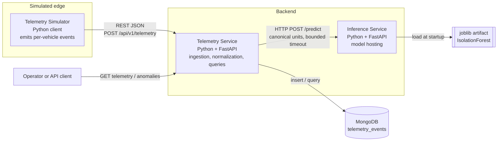
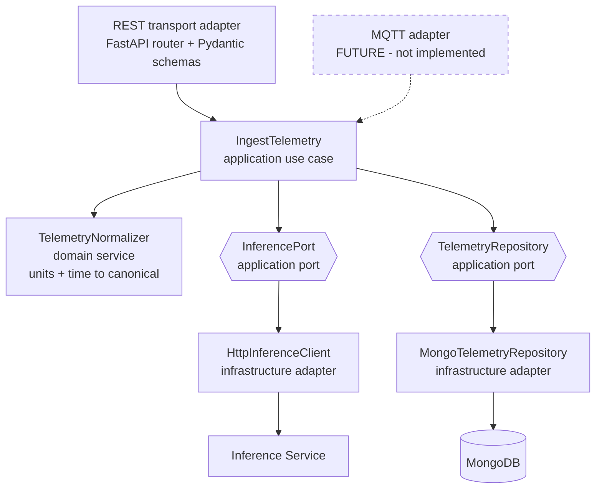
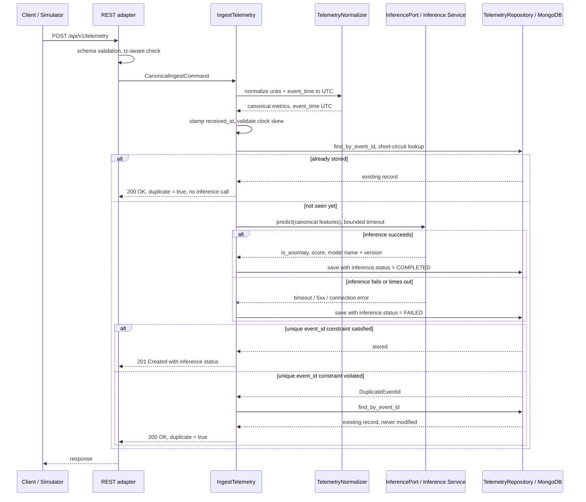
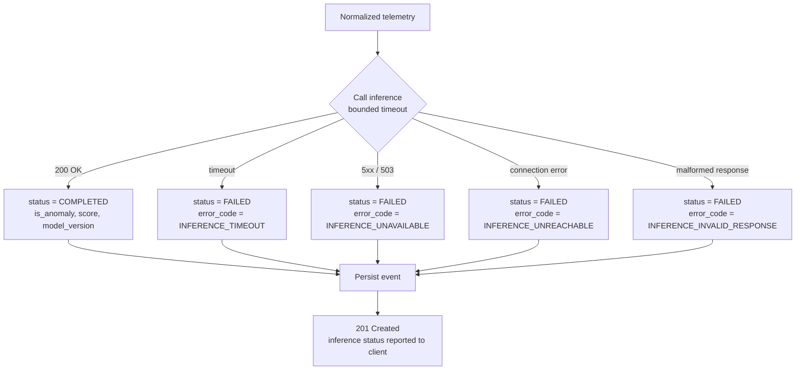
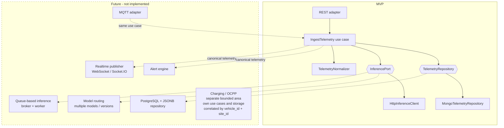

# Architecture

System architecture for **fleet-ai-anomaly-detection-system**: a Python backend for multinational
EV fleet telemetry ingestion and ML-based anomaly detection.

**Status of this document:** phase-1 design. No application code exists yet. Statements written in
the present tense ("the normalizer converts…") describe the *specified* MVP behavior that later
phases implement. Anything beyond the MVP is explicitly marked *architecture-supported* or
*future*.

## Contents

1. [Purpose and scope](#1-purpose-and-scope)
2. [Context and container view](#2-context-and-container-view)
3. [Telemetry Service internals](#3-telemetry-service-internals)
4. [Ports and adapters](#4-ports-and-adapters)
5. [Planned code layout](#5-planned-code-layout)
6. [API contracts](#6-api-contracts)
7. [Telemetry contract and unit normalization](#7-telemetry-contract-and-unit-normalization)
8. [Time handling](#8-time-handling)
9. [Event identity and idempotency](#9-event-identity-and-idempotency)
10. [Persistence design](#10-persistence-design)
11. [Model and inference design](#11-model-and-inference-design)
12. [Failure policy](#12-failure-policy)
13. [Multinational system concerns](#13-multinational-system-concerns)
14. [Future extension points](#14-future-extension-points)
15. [Observability](#15-observability)
16. [Out of scope](#16-out-of-scope)
17. [Glossary](#17-glossary)

---

## 1. Purpose and scope

The system ingests telemetry emitted by EV fleet vehicles operating at sites in different
countries, normalizes it into a single canonical representation, scores each event for anomaly
with a scikit-learn model, and stores the result as an append-only event history queryable per
vehicle and time range.

**Primary constraint:** the MVP must stay small enough to implement and explain clearly. Extension
points are preserved where they are free; speculative abstractions are not created.

**MVP boundary in one sentence:** one REST transport, one normalizer, one synchronous HTTP
inference call, one MongoDB collection, one model artifact.

---

## 2. Context and container view



**Why two services rather than one process.** The split is deliberate and is the point of the
exercise: it forces an explicit inference *boundary* with its own contract, versioning surface
(`/model/info`), independent lifecycle, and — most importantly — a real failure mode to design
against (see [Failure policy](#12-failure-policy)). A model loaded in-process would hide all four.
The cost is one network hop and one more deployable, which the MVP accepts.

---

## 3. Telemetry Service internals

The Telemetry Service has one application use case for writes, `IngestTelemetry`, and thin query
handlers for reads.



The write path, in order:



**Duplicate branches.** The authoritative duplicate check is the **unique `event_id` constraint**
enforced by the store on `save`; the lookup before inference is only a short-circuit that avoids a
wasted inference call, never the correctness guarantee. Both duplicate paths return the record that
was stored first — an existing event is never overwritten or updated. The duplicate paths are the
*specified* behavior; the mechanism is not implemented in this phase (see
[§9](#9-event-identity-and-idempotency)). Every other step in the diagram is MVP scope.

**Ordering note.** Inference is attempted *before* the single persistence write, so the MVP writes
each event exactly once. The trade-off is that a crash between the inference call and the write
loses the event — recovered by the client retrying the same `event_id`, which is safe by
[idempotency](#9-event-identity-and-idempotency). The alternative — persist first with
`status = PENDING`, then update — costs a second write and is the natural shape once inference
becomes asynchronous (see [ADR-0002](DECISIONS.md#adr-0002-synchronous-http-inference-for-the-mvp)).

---

## 4. Ports and adapters

This is **not** a hexagonal-architecture framework. There are exactly two ports, each justified by
a real external system and a plausible alternate implementation.

| Port | Why it exists | MVP adapter | Plausible alternates |
| --- | --- | --- | --- |
| `InferencePort` | The model is a separate networked system with its own failure modes | `HttpInferenceClient` | queue-based inference, in-process model, per-model routing |
| `TelemetryRepository` | The event store is external infrastructure | `MongoTelemetryRepository` | PostgreSQL + JSONB, in-memory fake for tests |

`TelemetryRepository` is a **specific** interface — `save`, `find_by_event_id`,
`find_by_vehicle_and_time_range`, `find_anomalies_by_vehicle_and_time_range` — shaped by the
access patterns in [Persistence design](#10-persistence-design). It is not a generic
`Repository[T]` with `filter(**kwargs)`.

The port speaks **domain identity only**: its methods take and return `event_id`, and `save`
signals a uniqueness violation as a `DuplicateEventId` outcome. No storage-assigned identity —
MongoDB's `_id`, a SQL surrogate key — crosses the boundary, so an alternate adapter preserves the
same idempotency semantics without leaking its own identity concepts upward. See
[ADR-0005](DECISIONS.md#adr-0005-event_id-as-the-idempotency-key).

### Deliberately *not* abstracted

| Thing | Why no port |
| --- | --- |
| `TelemetryNormalizer` | Pure domain logic over in-memory values. No external system, no alternate implementation. A plain class/function. |
| Clock (`received_at`) | Testability seam only. Injected as a callable parameter if tests need it — not a port, not an interface. |
| FastAPI / Pydantic | The framework *is* the transport adapter. Wrapping it adds indirection and removes nothing. |
| Configuration | One settings object per service, read from environment. No provider abstraction. |
| Logging / metrics | Standard library logging with structured fields. No facade. |
| "Event bus", unit-of-work, DI container, plugin registry, model registry | No second implementation exists or is planned for the MVP. Add when the second one arrives, not before. |

The bar for adding a port later: *there is a second real implementation, or an external system with
independent failure modes.* Anything else stays concrete.

---

## 5. Planned code layout

Created in later phases. Listed here so the boundaries above map to directories.

```text
services/
  telemetry_service/
    api/                  # FastAPI routers, request/response schemas, error mapping
    application/          # IngestTelemetry, InferencePort, TelemetryRepository, DTOs
    domain/               # telemetry model, units, TelemetryNormalizer, validation rules
    infrastructure/       # MongoTelemetryRepository, HttpInferenceClient, settings
  inference_service/
    api/                  # /health, /model/info, /predict
    model/                # artifact loading, metadata, feature ordering
ml/                       # training script -> joblib artifact
simulator/                # telemetry simulator client
docs/
```

Dependency direction: `api → application → domain`, with `infrastructure` implementing
`application` ports. `domain` imports nothing from the other layers.

---

## 6. API contracts

All APIs are **locale-independent**: JSON numbers use `.` as decimal separator with no digit
grouping, timestamps are RFC 3339, identifiers are opaque UTF-8 strings, and error `code` values —
not human-readable `message` strings — are the machine contract. Request and response bodies are
UTF-8; no `Accept-Language` negotiation exists in the MVP.

Error envelope, used by both services:

```json
{
  "error": {
    "code": "NAIVE_TIMESTAMP",
    "message": "event_time must include a UTC offset or Z designator",
    "details": { "field": "event_time", "value": "2026-08-31T09:14:22.481" }
  }
}
```

### 6.1 Telemetry Service

#### `GET /health`

Shallow liveness of the process. Deliberately does **not** check MongoDB or the Inference Service:
a dependency outage must not make this instance look dead, because ingestion still works in
degraded form ([fail-open for telemetry persistence](#12-failure-policy)). A readiness endpoint
with dependency checks is a future concern.

```json
{ "status": "ok", "service": "telemetry-service", "version": "0.1.0" }
```

#### `POST /api/v1/telemetry`

Ingest exactly one telemetry event. Request body: the [telemetry input
contract](#7-telemetry-contract-and-unit-normalization).

* `201 Created` — new event stored.
* `200 OK` — duplicate `event_id`; the record stored first is returned unchanged with
  `"duplicate": true` and no second inference call is made. Detection relies on the unique
  `event_id` constraint *(architecture-supported; the mechanism is not implemented in the MVP —
  see [§9](#9-event-identity-and-idempotency))*.
* `422 Unprocessable Entity` — validation failure (see error codes below).

```json
{
  "event_id": "3f0a9c2e-6f4b-4a6f-9d6e-2b1c8f4a77e1",
  "vehicle_id": "veh-tw-0142",
  "site_id": "site-taipei-01",
  "event_time": "2026-08-31T01:14:22.481Z",
  "received_at": "2026-08-31T01:14:23.002Z",
  "duplicate": false,
  "metrics": {
    "soc": 78.5,
    "battery_voltage": 396.2,
    "battery_current": -14.7,
    "battery_temperature": 35.7778,
    "speed": 51.9818,
    "motor_rpm": 4120.0
  },
  "inference": {
    "status": "COMPLETED",
    "is_anomaly": false,
    "score": 0.0412,
    "model_name": "isolation-forest-telemetry",
    "model_version": "0.1.0",
    "error_code": null
  }
}
```

Metrics in every response are **canonical**; units are documented, not repeated per value. The
source units the client sent are retained in storage as provenance ([§10](#10-persistence-design))
but are not echoed here.

#### `GET /api/v1/vehicles/{vehicle_id}/telemetry`

| Query param | Type | Default | Notes |
| --- | --- | --- | --- |
| `start` | tz-aware ISO-8601 | required | inclusive lower bound on `event_time` |
| `end` | tz-aware ISO-8601 | required | exclusive upper bound on `event_time` |
| `limit` | int | 100 | max 1000 |

Ordered by `event_time` **descending**, tie-broken by `event_id` for a stable total order. See
[ordering and out-of-order events](#83-out-of-order-events).

```json
{
  "vehicle_id": "veh-tw-0142",
  "start": "2026-08-31T00:00:00Z",
  "end": "2026-09-01T00:00:00Z",
  "count": 2,
  "items": [ { "...": "same shape as the ingest response" } ]
}
```

An unknown `vehicle_id` returns `200` with an empty `items` array, not `404`. The MVP has no
vehicle registry, so "vehicle does not exist" and "vehicle has no events in this range" are not
distinguishable. A registry would make `404` meaningful; that is a future concern.

#### `GET /api/v1/vehicles/{vehicle_id}/anomalies`

Same parameters and ordering. Returns only events where
`inference.status = COMPLETED AND inference.is_anomaly = true`.

Events with `inference.status = FAILED` are **never** returned here — an unscored event is not a
non-anomaly, and the system does not guess. They remain visible through the telemetry endpoint
with their `FAILED` status.

#### Error codes

| Code | HTTP | Meaning |
| --- | --- | --- |
| `SCHEMA_VALIDATION_FAILED` | 422 | Missing/malformed field |
| `UNSUPPORTED_SCHEMA_VERSION` | 422 | `schema_version` not supported by this service |
| `NAIVE_TIMESTAMP` | 422 | `event_time` lacks a UTC offset |
| `UNSUPPORTED_UNIT` | 422 | Unit not accepted for that metric |
| `UNKNOWN_METRIC` | 422 | Metric key not in the MVP metric set |
| `MISSING_METRIC` | 422 | A required metric is absent |
| `CLOCK_SKEW_FUTURE` | 422 | `event_time` too far ahead of `received_at` |
| `EVENT_TOO_OLD` | 422 | `event_time` older than the accepted ingestion window |
| `INVALID_TIME_RANGE` | 422 | `start >= end`, or range exceeds the permitted span |

### 6.2 Inference Service

The inference service is **stateless and unit-agnostic**: it accepts canonical values only, has no
knowledge of vehicles, sites, or client preferences, and performs no unit conversion.

#### `GET /health`

```json
{ "status": "ok", "service": "inference-service", "version": "0.1.0", "model_loaded": true }
```

Returns `200` with `"model_loaded": false` if the artifact failed to load — the process is alive
but cannot serve predictions.

#### `GET /model/info`

```json
{
  "model_name": "isolation-forest-telemetry",
  "model_version": "0.1.0",
  "algorithm": "sklearn.ensemble.IsolationForest",
  "trained_at": "2026-08-31T00:00:00Z",
  "feature_order": [
    "soc", "battery_voltage", "battery_current",
    "battery_temperature", "speed", "motor_rpm"
  ],
  "canonical_units": {
    "soc": "percent", "battery_voltage": "V", "battery_current": "A",
    "battery_temperature": "degC", "speed": "km/h", "motor_rpm": "rpm"
  },
  "artifact_sha256": "…",
  "sklearn_version": "…"
}
```

`feature_order` and `canonical_units` are part of the contract, not documentation: they let a
caller verify it is speaking the same dialect as the loaded artifact.

#### `POST /predict`

```json
{
  "features": {
    "soc": 78.5, "battery_voltage": 396.2, "battery_current": -14.7,
    "battery_temperature": 35.7778, "speed": 51.9818, "motor_rpm": 4120.0
  }
}
```

```json
{
  "is_anomaly": false,
  "score": 0.0412,
  "model_name": "isolation-forest-telemetry",
  "model_version": "0.1.0"
}
```

`score` is the IsolationForest decision function: negative values are more anomalous,
`is_anomaly` is `true` when the model's prediction is `-1`. The threshold lives in the model
artifact, not in the Telemetry Service.

* `422` — missing feature, non-numeric value, unknown feature key.
* `503` with `MODEL_NOT_LOADED` — artifact unavailable.

There is no batch endpoint in the MVP. Adding `POST /predict:batch` later is additive and does not
change the single-event contract.

---

## 7. Telemetry contract and unit normalization

### 7.1 Input contract

| Field | Type | Rule |
| --- | --- | --- |
| `schema_version` | string | `"1.0"` in the MVP; unrecognized values rejected |
| `event_id` | string | Globally unique per emitted event; UUIDv4 recommended, opaque to the server |
| `vehicle_id` | string | Opaque pseudonymous identifier |
| `site_id` | string | Opaque site identifier; regional identity is derived from site metadata, not parsed from the string |
| `event_time` | string | Timezone-aware ISO-8601 |
| `metrics` | object | All six metrics required, each `{ "value": <number>, "unit": <string> }` |

`vehicle_id` and `site_id` are treated as opaque UTF-8 strings. The system never parses meaning out
of an identifier — `veh-tw-0142` is illustrative, not structural.

### 7.2 Why units are per-metric

A request-level `"metric"` / `"imperial"` flag is wrong for this domain. Firmware routinely mixes
conventions: a North American vehicle may report `mph` for speed while its battery management
system reports `degC`, and a millivolt-resolution sensor may report `mV` regardless of region.
Units are a property of *each measurement*, so they are declared per metric.

Units are always **explicit**. There is no default unit — an omitted `unit` is a validation error,
not an assumption. A silently-assumed unit is the failure mode this contract exists to prevent.

### 7.3 Canonical units and conversions

| Metric | Canonical | Accepted source unit → conversion |
| --- | --- | --- |
| `soc` | `percent` | `percent` → identity; `fraction` → `× 100` |
| `battery_voltage` | `V` | `V` → identity; `mV` → `÷ 1000` |
| `battery_current` | `A` | `A` → identity; `mA` → `÷ 1000` |
| `battery_temperature` | `degC` | `degC` → identity; `degF` → `(v − 32) × 5/9`; `K` → `v − 273.15` |
| `speed` | `km/h` | `km/h` → identity; `mph` → `× 1.609344`; `m/s` → `× 3.6` |
| `motor_rpm` | `rpm` | `rpm` → identity |

Rules:

* Conversion happens **once**, at the ingestion boundary, in `TelemetryNormalizer`.
* Values are converted in IEEE-754 double precision and stored **unrounded**. Rounding is a
  display concern and belongs to clients. *(The examples in this document show four decimals for
  readability.)*
* Unit strings are matched **case-sensitively** against a fixed table. `"C"`, `"celsius"`, `"KMH"`
  are rejected with `UNSUPPORTED_UNIT` rather than guessed.
* An unsupported unit is a rejection, never a pass-through — an unconverted value reaching the
  model is worse than a rejected event.
* `motor_rpm` has one accepted unit, but still requires an explicit `unit` field. Uniformity keeps
  the contract, the validator, and future additions simple.

Worked example, matching the [ingest response above](#post-apiv1telemetry):
`96.4 degF → (96.4 − 32) × 5/9 = 35.7778 degC`, and `32.3 mph → 32.3 × 1.609344 = 51.9818 km/h`.

### 7.4 Metric set and schema evolution

All six metrics are required in the MVP because the model consumes a fixed-length feature vector
and the MVP performs no imputation. Unknown metric keys are **rejected** (`UNKNOWN_METRIC`) so
firmware mistakes surface immediately rather than being silently dropped.

That strictness is a deliberate MVP-scale choice, and it is the first thing that changes when a
second firmware generation appears: the forward-compatible policy is to accept unknown metrics,
preserve them in the stored document, and exclude them from the feature vector until a model
version consumes them. `schema_version` in the payload and `/api/v1` in the URL are the two
evolution levers, covering payload shape and endpoint contract respectively. See
[§13](#13-multinational-system-concerns).

---

## 8. Time handling

### 8.1 `event_time` versus `received_at`

Two timestamps, because in a distributed IoT system they answer different questions:

* **`event_time`** — when the measurement happened, according to the *device*. It is the
  physically meaningful timestamp: it is what a time-series of battery temperature must be plotted
  against, and what a model or an engineer reasons about.
* **`received_at`** — when the Telemetry Service accepted the event, according to the *server*. It
  is the operationally meaningful timestamp: it reflects a single trusted clock and reveals
  delivery behavior.

They diverge for reasons that are normal, not exceptional:

* **Connectivity gaps.** A vehicle in a parking structure or a tunnel buffers events locally and
  flushes them minutes or hours later.
* **Retries.** A client re-sends an event after a timeout; `event_time` is unchanged,
  `received_at` moves.
* **Network and regional latency.** A site in Asia-Pacific talking to a service deployed elsewhere
  adds latency that varies over the day.
* **Device clock error.** Cheap RTCs drift; a device that has not synchronized NTP after a cold
  boot can be seconds to days off.

Keeping only `event_time` makes it impossible to detect delivery problems or a lying device clock.
Keeping only `received_at` corrupts the physical time-series: buffered events would appear to have
happened at flush time. Both are stored; both are UTC.

### 8.2 Normalization rules

* Input `event_time` must be timezone-aware ISO-8601. **Naive timestamps are rejected**
  (`NAIVE_TIMESTAMP`) — a timestamp without an offset is ambiguous across the fleet's regions, and
  guessing "probably UTC" or "probably the site's timezone" produces silently wrong data.
* `event_time` is converted to UTC at ingestion. The original offset is not preserved in the MVP;
  local wall-clock time is reconstructed for display from the site's IANA timezone if that is ever
  needed.
* `received_at` is generated by the Telemetry Service from its own clock, in UTC, and is never
  accepted from the client.
* Site timezones, if stored as metadata later, use **IANA names** (`Asia/Taipei`, `Europe/Prague`,
  `America/Los_Angeles`) — never fixed UTC offsets. `+02:00` is not a timezone: Prague is `+01:00`
  in winter and `+02:00` in summer, and a stored offset silently breaks twice a year at the DST
  transition. IANA names carry the full historical and future rule set. See
  [ADR-0004](DECISIONS.md#adr-0004-timezone-aware-input-utc-persistence-iana-site-timezones).

### 8.3 Out-of-order events

Events arrive out of order routinely — buffered flushes, retries, and multi-region latency all
reorder delivery. The MVP handles this by **not depending on arrival order at all**:

* Storage is append-only and each event is identified by `event_id`. There is no per-vehicle
  sequence number, no "latest" pointer to update, and therefore nothing that a late event can
  corrupt.
* Queries order by `event_time`, not by insertion order or storage identity. A late-arriving event
  appears in its correct temporal position the moment it is stored, with no reprocessing.
* Each event is scored independently by the model, so scoring does not depend on order either.
* `received_at` preserves the true arrival order for diagnostics — comparing the two timestamps is
  how delivery lag is measured.

Not in the MVP, and not needed by it: watermarks, windowing, late-arrival buffers, reordering
queues, or event-time triggers. Those become relevant only for stateful stream processing —
rolling aggregates, sequence-based alerting — which the MVP does not do.

### 8.4 Clock-skew validation

Two bounds, both configurable, both applied against `received_at`:

| Rule | Default | Rejection code | Rationale |
| --- | --- | --- | --- |
| `event_time` may not be more than *N* ahead of `received_at` | 300 s | `CLOCK_SKEW_FUTURE` | Physically impossible; indicates an unsynchronized device clock. The small tolerance absorbs benign NTP jitter. |
| `event_time` may not be more than *M* behind `received_at` | 30 days | `EVENT_TOO_OLD` | Bounds the ingestion window; a months-old event is a device or replay fault, not a buffered flush. |

The MVP **rejects** rather than corrects. Silently rewriting a device's timestamp to server time
destroys the evidence that the device clock is wrong and fabricates a measurement time. A future
production system would instead quarantine such events and record a per-device skew metric — the
rejection codes above are the seam for that.

---

## 9. Event identity and idempotency

`event_id` is globally unique for an emitted telemetry event. It is generated by the device or
simulator at emission time and is **stable across retries** — a retry of the same measurement
carries the same `event_id`. A new measurement always gets a new one.

At-least-once delivery is the norm here: a client that times out cannot know whether the server
stored the event, so it retries. Without idempotency, every timeout inflates the fleet's history
with duplicates that corrupt counts and time-series.

**Intended behavior** (specified now, mechanism **not implemented** in this phase):

| Situation | Result |
| --- | --- |
| First arrival of an `event_id` | Stored; `201 Created`; `duplicate: false` |
| Retry with the same `event_id` and the same payload | No second record, no second inference call; `200 OK`; `duplicate: true`; the stored record is returned |
| Same `event_id` with a *different* payload | The write is rejected by the uniqueness constraint; the originally stored event is **never overwritten or updated**, and the conflict is logged with the differing fields. The response is the stored original with `duplicate: true`. Rejecting with `409` instead is a defensible alternative and is deferred until there is evidence of it happening. |

### 9.1 Domain identity is independent of storage identity

`event_id` is a **domain** identifier. It is not the storage engine's primary key, and the
application never reads or exposes a storage-assigned identity.

**Intended mechanism:** a **unique index on `event_id`** in the `telemetry_events` collection.
MongoDB keeps its own internal `_id` (an ordinary `ObjectId` it assigns), which is never read by
the application, never returned by the API, and never crosses the `TelemetryRepository` boundary.
Uniqueness is enforced by that index, and a duplicate insert surfaces as a uniqueness violation the
use case translates into the `200 duplicate` response — checked by the database rather than by a
read-then-write race in application code.

The lookup by `event_id` before inference is a **short-circuit optimization** that avoids a wasted
inference call on an obvious retry. It is deliberately *not* the correctness mechanism: between
that read and the write, a concurrent request can insert the same `event_id`, and only the unique
constraint closes that race.

Keeping the two identities separate is what makes the semantics portable. A PostgreSQL
implementation stores `event_id` as a column with `UNIQUE (event_id)` alongside whatever surrogate
primary key it prefers, translates its unique-violation error into the same `DuplicateEventId`
outcome, and reproduces the behavior table above exactly — with no MongoDB identity concept
appearing anywhere in the application layer. Details in [§10](#10-persistence-design) and
[ADR-0005](DECISIONS.md#adr-0005-event_id-as-the-idempotency-key).

This property is transport-independent by construction: because idempotency lives in
`IngestTelemetry` and the repository, a future MQTT adapter — where at-least-once delivery is
built into QoS 1 — inherits it without writing any new logic.

---

## 10. Persistence design

Single collection: **`telemetry_events`**. One document per telemetry event. Append-only: documents
are inserted, never updated in the MVP — which is also what guarantees that a conflicting retry
cannot overwrite an event that is already stored.

### 10.1 Document shape

```json
{
  "_id": "ObjectId - assigned by MongoDB, storage identity only, never used by the application",
  "event_id": "3f0a9c2e-6f4b-4a6f-9d6e-2b1c8f4a77e1",
  "schema_version": "1.0",
  "vehicle_id": "veh-tw-0142",
  "site_id": "site-taipei-01",
  "event_time": "ISODate 2026-08-31T01:14:22.481Z",
  "received_at": "ISODate 2026-08-31T01:14:23.002Z",
  "metrics": {
    "soc": 78.5,
    "battery_voltage": 396.2,
    "battery_current": -14.7,
    "battery_temperature": 35.777777777777779,
    "speed": 51.98181120,
    "motor_rpm": 4120.0
  },
  "source_units": {
    "soc": "percent", "battery_voltage": "V", "battery_current": "A",
    "battery_temperature": "degF", "speed": "mph", "motor_rpm": "rpm"
  },
  "inference": {
    "status": "COMPLETED",
    "is_anomaly": false,
    "score": 0.0412,
    "model_name": "isolation-forest-telemetry",
    "model_version": "0.1.0",
    "error_code": null
  },
  "ingest": { "transport": "rest", "api_version": "v1" }
}
```

Notes:

* `_id` is **MongoDB's own storage identity**. It is assigned by the driver, never read by the
  application, never returned by the API, and never crosses the `TelemetryRepository` boundary.
* `event_id` is the **domain identity** and the idempotency key, stored as an ordinary field under
  a unique index ([§9.1](#91-domain-identity-is-independent-of-storage-identity)). An alternate
  store keeps the same field and the same uniqueness guarantee under its own primary-key scheme.
* `metrics` holds **canonical scalars only**. Units are a property of the schema, not of each
  stored value — storing `{value, unit}` per metric would invite mixed units in one collection,
  which is exactly what normalization exists to prevent.
* `source_units` is provenance: it answers "what did the device actually send?" after the fact,
  which matters when a conversion bug is suspected. It is never used for querying or scoring.
* `inference` records *what the model said and which model said it*. Version fields make a
  historical result interpretable after the model changes.
* `ingest.transport` distinguishes REST from a future MQTT path without changing the document
  shape.
* BSON dates are UTC with millisecond precision. Sub-millisecond device precision is not preserved
  — acceptable for this domain, where sampling is on the order of seconds.

### 10.2 Access patterns and indexes

| Access pattern | Endpoint | Index |
| --- | --- | --- |
| Idempotent insert by event identity | `POST /telemetry` | **unique** index `{ event_id: 1 }` |
| Vehicle + time range, newest first | `GET …/telemetry` | `{ vehicle_id: 1, event_time: -1 }` |
| Anomalies for a vehicle + time range | `GET …/anomalies` | partial index `{ vehicle_id: 1, event_time: -1 }` filtered on `inference.is_anomaly: true` and `inference.status: "COMPLETED"` |

The unique index on `event_id` is the enforcement point for idempotency: it rejects a second
insert of the same domain event regardless of which transport, process, or concurrent request
attempts it. It also serves the short-circuit lookup before inference and the fetch of the stored
original when a duplicate is detected.

A partial index for the anomaly query keeps it proportional to the number of anomalies rather than
the number of events — anomalies are by definition a small fraction of the collection.

There are no other collections in the MVP. A vehicle or site registry, model metadata, and alerts
are future work, and none of them require reshaping `telemetry_events`.

### 10.3 Why MongoDB, and when PostgreSQL would be better

Summarized here; full record in
[ADR-0001](DECISIONS.md#adr-0001-mongodb-as-the-mvp-telemetry-event-store).

Reasons that hold:

* Telemetry is **append-heavy immutable event documents** with essentially no updates or joins —
  a document store's write path and access model fit that directly.
* **Device and firmware generations evolve their metric sets** independently and continuously; a
  per-document schema absorbs that without coordinated migrations across a fleet.
* The **primary access patterns are compound and narrow** — vehicle + time range, anomaly + time
  range — and are served well by compound and partial indexes.
* The project **intentionally exercises a NoSQL persistence model** as an explicit learning
  objective.

Reason that does **not** hold, and is explicitly rejected: *"the payload is JSON."* Serialization
format is not a storage argument. PostgreSQL stores JSON natively in `JSONB`, with indexing, and
would handle this payload without difficulty.

PostgreSQL + JSONB is a **viable alternative**, preferable when:

* the metric schema stabilizes and constraints/types should be enforced by the database;
* relational requirements appear — vehicles, sites, models, alerts, maintenance records as
  first-class related entities with foreign keys;
* queries need real **joins** across those entities rather than denormalization;
* workflows need **multi-row transactional** guarantees;
* analytics get complex — window functions, CTEs, percentile aggregates — where SQL is markedly
  more expressive than an aggregation pipeline;
* the operational preference is one database engine for both relational and document data.

Neither database is inherently superior. MongoDB fits this MVP's shape and stated goals;
PostgreSQL would fit a relationally-richer version of the same system. Storage sits behind
`TelemetryRepository`, so the decision is revisitable at the cost of one adapter — with the honest
caveat that a real migration also involves data movement and index redesign, not just new code.

---

## 11. Model and inference design

**Model quality is not the objective of this project.** The engineering objective is a complete,
honest model lifecycle: *training → artifact creation → artifact loading → model metadata and
version → inference API → failure behavior.*

| Aspect | MVP choice |
| --- | --- |
| Algorithm | `sklearn.ensemble.IsolationForest` — unsupervised, needs no labeled anomalies, trains in seconds on simulated data |
| Artifact | Single `joblib` file containing the fitted estimator plus metadata |
| Features | The six canonical metrics, in a **fixed order** that is part of the artifact contract |
| Serving | Dedicated FastAPI service, artifact loaded once at startup |
| Versioning | `model_name` + `model_version` in the artifact, exposed via `/model/info`, recorded on every scored event |

Rules that keep the boundary clean:

* The inference service receives **canonical values only** and performs no unit conversion. A
  model that has to know whether a client prefers mph has been given a display concern, and its
  behavior would silently change with the caller's locale.
* **Feature order is contractual.** The Telemetry Service builds the vector from
  `feature_order` semantics; a reordering is a model version change, not a refactor.
* The **anomaly threshold lives in the artifact**, not in the Telemetry Service. The caller
  receives a decision, not the responsibility for making one.
* Artifact load failure is a **first-class state**: `/health` reports `model_loaded: false` and
  `/predict` returns `503 MODEL_NOT_LOADED` rather than serving a fabricated score.
* No model registry, no A/B routing, no online retraining in the MVP. `model_version` on every
  stored event is what makes those additive later.

Training (`ml/`, later phase) fits IsolationForest on simulated normal-operation telemetry in
canonical units and writes the artifact plus its metadata. Because training data is generated by
the same simulator that feeds ingestion, the model is a plausible demonstration, not a
production-validated detector — and the system records that honestly through `model_version`
rather than implying otherwise.

---

## 12. Failure policy

Ingestion has **two distinct downstream dependencies, with opposite failure policies**. The terms
are used in exactly this sense everywhere in these documents:

| Dependency fails | Policy | Meaning |
| --- | --- | --- |
| **Inference failure** | **fail-open for telemetry persistence** | The event is still persisted. `inference.status = FAILED` is recorded, no anomaly result is invented, and the client gets `201 Created`. Ingestion succeeds with a known-incomplete result. |
| **Persistence failure** | **fail-closed for ingestion** | Ingestion fails. The client gets `503 Service Unavailable` and must retry — which is safe because retries are idempotent on `event_id` ([§9](#9-event-identity-and-idempotency)). Nothing is acknowledged that was not stored. |

The asymmetry is the whole point: **fail-open applies only to the derived score, never to the
measurement.** Telemetry is the irreplaceable asset; an anomaly score is derived data that can be
recomputed later. Losing a measurement because a model server was restarting is the worst available
outcome — but acknowledging an event that was never stored is equally unacceptable, because the
client would stop retrying and the measurement would be lost with no record that it ever existed.

### 12.1 Inference failure — fail-open for telemetry persistence

When inference times out, returns an error, or is unreachable:

1. **Preserve the telemetry** — the event is stored with its canonical metrics.
2. **Record `inference.status = FAILED`** with an `error_code` describing the failure class.
3. **Invent nothing** — `is_anomaly` and `score` stay `null`. Defaulting to "not an anomaly" would
   record a false negative as if the model had spoken.
4. **Expose the incompleteness** — the ingest response and telemetry queries show `FAILED`, and the
   anomalies endpoint excludes such events entirely.



| Failure | HTTP result to client | `inference.status` | Telemetry preserved |
| --- | --- | --- | --- |
| Inference timeout — *fail-open* | `201 Created` | `FAILED` | Yes |
| Inference `5xx` / model not loaded — *fail-open* | `201 Created` | `FAILED` | Yes |
| Inference unreachable — *fail-open* | `201 Created` | `FAILED` | Yes |
| Malformed inference response — *fail-open* | `201 Created` | `FAILED` | Yes |
| **Persistence unavailable / write error** | `503 Service Unavailable` | — | **No** — fail-closed |
| Duplicate `event_id` | `200 OK`, `duplicate: true` | as originally stored | Yes — original preserved unchanged |
| Validation failure | `422` | — | No |

### 12.2 Persistence failure — fail-closed for ingestion

If the event cannot be stored, ingestion **fails closed**: the request returns `503 Service
Unavailable` rather than a success code, so the client knows the event was not accepted and retries.
That retry is safe by [idempotency](#9-event-identity-and-idempotency) — the unique `event_id`
constraint guarantees the eventual successful attempt creates exactly one record even if an earlier
attempt partially succeeded. A `2xx` for an unstored event would be the one truly unrecoverable
failure: the client discards its copy and the measurement is gone.

A duplicate `event_id` is **not** a persistence failure. It is a successful, expected outcome of
the uniqueness constraint and returns `200 OK` with `duplicate: true`
([§9](#9-event-identity-and-idempotency)).

**Timeout and retry policy.** One inference attempt per ingest, with a bounded timeout
(`INFERENCE_TIMEOUT_SECONDS`, default 2 s). No in-request retries in the MVP: retrying inside a
synchronous request multiplies tail latency while the client is blocked, and the client's own
retry already covers the transient case. A circuit breaker and a backfill job that re-scores
`FAILED` events are natural additions, both enabled by `inference.status` being recorded rather
than inferred. See
[ADR-0006](DECISIONS.md#adr-0006-fail-open-persistence-when-inference-fails).

---

## 13. Multinational system concerns

The fleet spans sites in different countries, timezones, unit conventions, and regulatory regimes.
Each concern below is classed as:

* **MVP** — specified for implementation in the MVP.
* **Architecture-supported** — the extension point exists; the behavior is not built.
* **Future** — deliberately out of scope; recorded so it is not rediscovered as a surprise.

| Concern | Class | Treatment |
| --- | --- | --- |
| Timezone handling | **MVP** | Timezone-aware input required, naive rejected, all storage in UTC |
| Daylight saving time | **MVP** (rule) / Architecture-supported (metadata) | IANA names mandated for any stored site timezone; fixed offsets forbidden. No site registry yet |
| Measurement-unit normalization | **MVP** | Per-metric explicit units, canonical conversion at the boundary |
| Locale-independent numeric APIs | **MVP** | JSON numbers, `.` decimal separator, no digit grouping, no localized parsing |
| UTF-8 / Unicode | **MVP** | UTF-8 end to end; identifiers are opaque Unicode strings, never parsed or case-folded |
| Event time vs receive time | **MVP** | Both stored; queries ordered by `event_time` |
| Device clock skew | **MVP** | Bounded future/past validation with distinct rejection codes |
| Out-of-order events | **MVP** | Order-independent by design: append-only, `event_time` ordering |
| Site and regional identity | Architecture-supported | `site_id` on every event; site→region→timezone metadata is a future collection |
| Schema evolution | **MVP** (versioning) / Architecture-supported (tolerant reads) | `schema_version` in payload; strict rejection now, accept-and-preserve later |
| Backward compatibility | Architecture-supported | Additive changes only within `v1`; `schema_version` gates payload changes |
| API versioning | **MVP** | `/api/v1` URL prefix from day one; breaking changes get `/api/v2` served side by side |
| Idempotency / duplicate events | Architecture-supported | Behavior specified in [§9](#9-event-identity-and-idempotency); mechanism not implemented |
| Regional latency | Future | Single-region deployment. Edge buffering, batch ingest, and regional endpoints are later work; `received_at` already measures the problem |
| Data residency | Future | Single MongoDB deployment. Regional partitioning by `site_id`, or per-region deployments, would be required for jurisdictions that mandate local storage |
| Privacy and PII | **MVP** (by exclusion) / Future | No driver identity, no location data, no VIN. `vehicle_id` and `site_id` are pseudonymous. Adding GPS or driver association makes this personal data and triggers real obligations |
| Regional compliance | Future | GDPR (EU sites), Taiwan PDPA, CCPA and similar bring retention limits, subject-access and deletion rights, and cross-border transfer rules. None implemented; the append-only model would need a documented deletion path |
| Observability across sites/regions | **MVP** (fields) / Future (aggregation) | Structured logs carry `vehicle_id`, `site_id`, `event_id`, transport, inference status and latency. Metrics, tracing and dashboards are future |

Two of these deserve emphasis because they are cheap now and expensive later:

* **Timezones and DST.** Storing `Europe/Prague` as `+01:00` is correct for half the year. The rule
  is enforced from the start precisely because retrofitting it means reinterpreting historical
  data.
* **PII by exclusion.** The MVP has no personal data mostly because it has no location or driver
  fields. That is a scope boundary, not a compliance posture, and the moment GPS is added the
  system needs a retention and deletion story.

---

## 14. Future extension points

None of the following is implemented. Each is listed with the *specific* seam that makes it
additive rather than a rewrite.



**1. MQTT adapter.** A broker subscriber deserializes the same telemetry contract and calls
`IngestTelemetry` — the identical use case REST calls. Normalization, skew validation, idempotency,
inference and persistence are inherited unchanged; only transport concerns (subscription, QoS,
back-pressure) are new. `ingest.transport` distinguishes the source in storage. The reason this
works is that the use case takes a domain command, not an HTTP request.

**2. Realtime publisher.** Canonical telemetry — the normalized event the use case already holds —
is published to a WebSocket/Socket.IO fan-out after persistence. Subscribers receive canonical
units and UTC times, so no transport-specific or unit-specific logic reaches the delivery layer.
The seam is a post-persistence hook in the use case, added when there is a consumer.

**3. Alert engine.** Alert rules evaluate **normalized** telemetry plus the inference result, never
source-specific payloads — a threshold expressed in `degC` must not depend on whether a device
reported `degF`. That is why normalization precedes everything downstream. Alerts start as a
consumer of stored/published canonical events, keeping them out of the ingest path.

**4. Async processing.** `InferencePort` hides whether scoring is a synchronous HTTP call or a
message published to a broker and consumed by a worker. Moving to a queue changes the adapter and
the persistence shape — the event is written first with `status = PENDING` and updated on
completion — but **does not change the ingest transport contract**. Clients keep posting the same
payload; they simply stop receiving a score in the response.

**5. Multiple models and versions.** Because `model_name` and `model_version` are already recorded
on every event, a routing adapter behind `InferencePort` can dispatch by vehicle class, region, or
experiment cohort. Historical results stay interpretable because each one names the model that
produced it. A model registry is the eventual home for that metadata.

**6. Alternate storage.** A PostgreSQL + JSONB implementation of `TelemetryRepository` replaces the
MongoDB one — the port's four methods are the whole contract. Because the port speaks `event_id`
and never a storage-assigned identity, that adapter reproduces the idempotency semantics exactly:
`event_id` becomes a column with `UNIQUE (event_id)` next to whatever surrogate primary key the
schema prefers, and its unique-violation error maps to the same `DuplicateEventId` outcome
([§9.1](#91-domain-identity-is-independent-of-storage-identity)). No generic repository
infrastructure is created to prepare for this; the port is deliberately specific.

**7. Charging and OCPP.** Charging sessions are a **separate bounded feature area** with their own
entities, lifecycle and contracts — not extra fields on telemetry events. OCPP is a stateful
protocol with its own message set and semantics; mixing it into telemetry ingestion would couple
two independently-evolving domains. It gets its own use cases, its own storage, and correlates to
telemetry through `vehicle_id` and `site_id`.

---

## 15. Observability

MVP: **structured JSON logs**, standard library logging, one line per ingest, carrying
`event_id`, `vehicle_id`, `site_id`, `transport`, `schema_version`, `inference.status`, inference
latency, total request latency, and the ingest-to-event delay (`received_at − event_time`). That
last field is the one that makes regional delivery problems visible without any additional
infrastructure.

An `X-Request-ID` header is accepted and echoed for correlation; if absent, one is generated.

Future: metrics (ingest rate, inference failure rate, skew distribution per site), distributed
tracing across the two services, and per-region dashboards. Not in the MVP.

---

## 16. Out of scope

Frontend · authentication/RBAC · MQTT · Redis · Kafka · Celery · Kubernetes · AWS · WebSocket /
Socket.IO · alert engine · OCPP · charging simulator · model registry · multi-region deployment ·
production HA · distributed transactions.

Also out of scope, and worth naming because they are commonly assumed: batch ingestion endpoints,
model retraining pipelines, data retention/deletion jobs, vehicle and site registries, readiness
probes with dependency checks, and rate limiting.

---

## 17. Glossary

| Term | Meaning |
| --- | --- |
| **Canonical units** | The single internal unit system (`percent`, `V`, `A`, `degC`, `km/h`, `rpm`) used for all storage and inference |
| **`event_time`** | Device-reported time of measurement, timezone-aware on input, stored in UTC |
| **`received_at`** | Server-stamped arrival time, UTC |
| **`event_id`** | Globally unique **domain** identifier of an emitted event; the idempotency key, enforced by a unique index and independent of any storage-assigned identity |
| **Storage identity** | A key the persistence engine assigns for its own use — MongoDB's `_id`, a SQL surrogate key. Never exposed by the API, never crossing the repository boundary |
| **`IngestTelemetry`** | The single application use case for the write path, shared by all transports |
| **Port** | An interface owned by the application layer, representing an external system with a plausible alternate implementation |
| **Fail-open for telemetry persistence** | Policy for **inference failure**: the telemetry is still stored, `inference.status = FAILED` is recorded, and no anomaly result is fabricated |
| **Fail-closed for ingestion** | Policy for **persistence failure**: ingestion returns `503` rather than acknowledging an event that was not stored, so the client's idempotent retry is the recovery mechanism |
